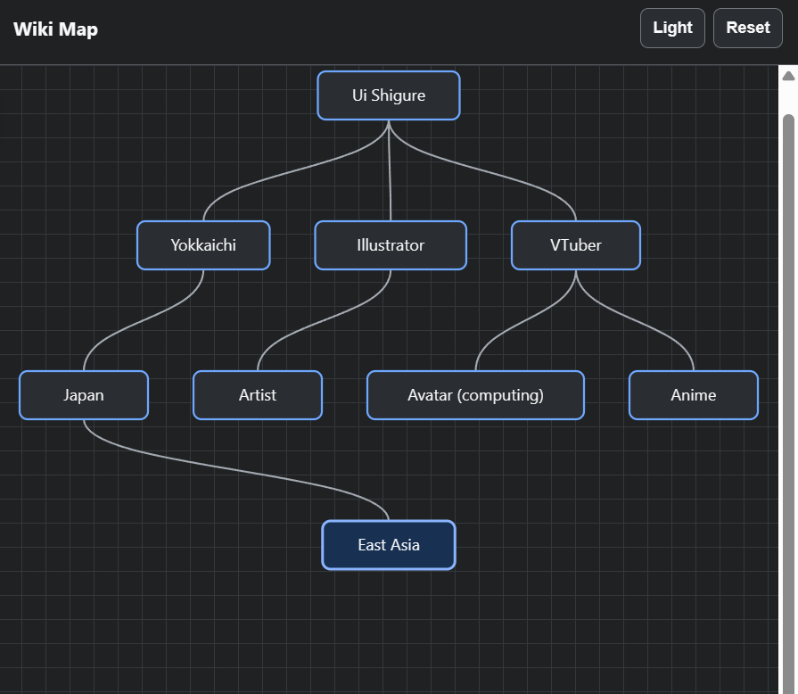

# Wiki Map

## English

Wiki Map is a Chrome extension that visualizes your Wikipedia browsing path as a mind map.

When you click links between Wikipedia articles, the extension records which page led to which page and displays the navigation history in a resizable side panel. The map grows vertically, supports drag-to-pan navigation, and includes light and dark modes.

### Example



### Features

- Track Wikipedia article-to-article navigation automatically
- Display page jumps as a vertical mind map
- Resize the right-side map panel
- Drag the map area to move the visible range
- Adjust node width based on page title length
- Switch between light and dark mode
- Reset saved map history
- Store data locally using Chrome extension storage

### Installation

This extension is not published on the Chrome Web Store yet. Install it as an unpacked extension.

1. Download this repository.
   - If you use Git, run:
     ```bash
     git clone https://github.com/TheVota/Wiki-Map.git
     ```
   - If you do not use Git, click **Code** on this GitHub page, choose **Download ZIP**, and unzip the downloaded file.
2. Open Google Chrome.
3. Open the extensions page.
   - Enter `chrome://extensions/` in the address bar.
4. Turn on **Developer mode** in the top-right corner.
5. Click **Load unpacked**.
6. Select the `Wiki-Map` folder.
   - Select the folder that contains `manifest.json`.
   - Do not select an individual file.
7. Confirm that **Wiki Map** appears in the extensions list.
8. Open a Wikipedia article page, such as `https://en.wikipedia.org/wiki/Wikipedia`.
9. Click links inside Wikipedia articles. The map will appear on the right side of the page and update as you browse.

### Updating

1. Download or pull the latest version of this repository.
2. Open `chrome://extensions/`.
3. Find **Wiki Map**.
4. Click the reload button on the extension card.
5. Reload any open Wikipedia tabs.

### Notes

- The extension works on Wikipedia article pages.
- Map data is stored locally in Chrome.
- Use the **Reset** button in the side panel to clear saved map history.

## 日本語

Wiki Mapは、Wikipediaでのページ移動をマインドマップとして可視化するChrome拡張機能です。

Wikipediaの記事内リンクをクリックすると、どのページからどのページへ移動したかを記録し、右側のリサイズ可能なサイドパネルに表示します。マップは縦方向に伸び、ドラッグによる表示範囲の移動やライトモード / ダークモードの切り替えに対応しています。

### 表示例


### 機能

- Wikipediaの記事間移動を自動記録
- ページ遷移を縦方向のマインドマップで表示
- 右側のマップパネルの幅を変更
- マップ表示範囲をドラッグで移動
- ページタイトルの長さに合わせてノード幅を調整
- ライトモード / ダークモード切り替え
- 保存されたマップ履歴をリセット
- データはChrome拡張のローカルストレージに保存

### インストール方法

この拡張機能は、現時点ではChromeウェブストアには公開していません。Chromeの「パッケージ化されていない拡張機能」として読み込みます。

1. このリポジトリをダウンロードします。
   - Gitを使う場合:
     ```bash
     git clone https://github.com/TheVota/Wiki-Map.git
     ```
   - Gitを使わない場合:
     GitHubページの **Code** ボタンを押し、**Download ZIP** を選択して、ダウンロードしたZIPファイルを展開します。
2. Google Chromeを開きます。
3. 拡張機能ページを開きます。
   - アドレスバーに `chrome://extensions/` と入力して開きます。
4. 右上の **デベロッパーモード** をオンにします。
5. **パッケージ化されていない拡張機能を読み込む** をクリックします。
6. `Wiki-Map` フォルダを選択します。
   - `manifest.json` が入っているフォルダを選択してください。
   - `manifest.json` などのファイル単体ではなく、フォルダを選択します。
7. 拡張機能一覧に **Wiki Map** が表示されていることを確認します。
8. Wikipediaの記事ページを開きます。
   - 例: `https://ja.wikipedia.org/wiki/Wikipedia`
9. Wikipediaの記事内リンクをクリックします。ページ右側にマップが表示され、移動するたびに更新されます。

### 更新方法

1. このリポジトリの最新版をダウンロード、または `git pull` します。
2. `chrome://extensions/` を開きます。
3. **Wiki Map** を探します。
4. 拡張機能カードの更新ボタンをクリックします。
5. 開いているWikipediaタブを再読み込みします。

### 補足

- この拡張機能はWikipediaの記事ページで動作します。
- マップデータはChrome内にローカル保存されます。
- 保存済みのマップ履歴を消す場合は、サイドパネルの **Reset** ボタンを使ってください。
